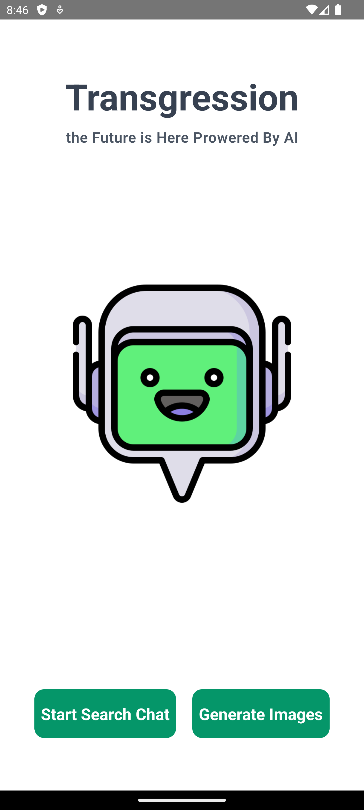
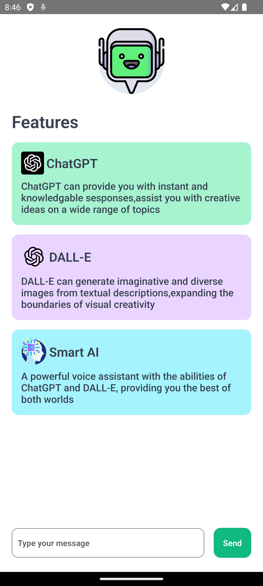
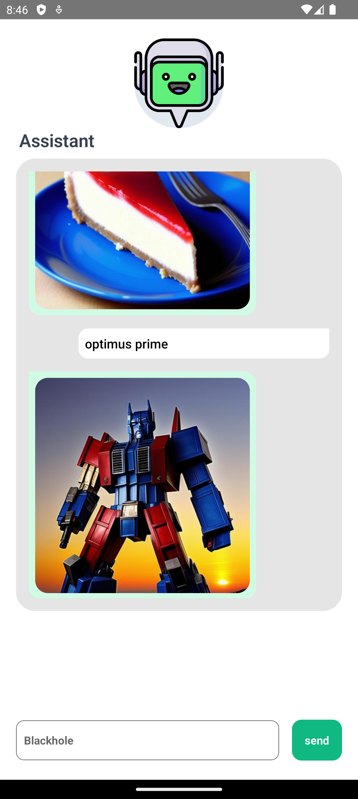

# React Native Voiced AI Chat & Image Bot

**React Native Voiced AI Chat & Image Bot** is an advanced AI-powered chatbot application built with React Native. It combines conversational AI (similar to ChatGPT) with image generation capabilities (like DALL·E). Additionally, it features AI-generated voice responses, allowing users to interact via voice input and receive spoken replies, creating a seamless and engaging user experience.

---

## Features

- **AI Chatbot:** Engage in natural language conversations powered by AI models.
- **Image Generation:** Generate images based on user prompts, similar to DALL·E.
- **Voice Input:** Users can tap a button and speak their queries or commands.
- **AI Voice Output:** The chatbot reads out responses using AI-generated speech.
- **Lightweight Models:** Uses efficient models like LLaMA to balance performance and resource usage.
- **Cross-Platform:** Built with React Native for Android and iOS compatibility.

---

## Download

Get the latest Android APK by clicking the button below:

[](https://vrajvyas11.github.io/React_Native-Voiced_AI_Chat_Image_Bot/)

---

## Demo Images




These images showcase the app’s image generation and chat capabilities.

---

## Getting Started

To run this project locally:

1. Clone the repository:
   ```bash
   git clone https://github.com/vrajvyas11/React_Native-Voiced_AI_Chat_Image_Bot.git
   ```
2. Navigate to the project directory:
   ```bash
   cd React_Native-Voiced_AI_Chat_Image_Bot
   ```
3. Install dependencies:
   ```bash
   npm install
   ```
4. Run the app on your device or emulator:
   ```bash
   npx react-native run-android
   # or
   npx react-native run-ios
   ```

---

## Technologies Used

- **React Native:** Cross-platform mobile app framework.
- **LLaMA (or similar lightweight models):** For efficient AI chat processing.
- **Text-to-Speech (TTS):** For AI voice responses.
- **Speech-to-Text (STT):** For voice input from users.
- **OpenAI / Custom AI APIs:** For chat and image generation backend.

---

## Future Improvements

- Enhance quantity and object recognition in images.
- Integrate more powerful AI models as device capabilities improve.
- Add multi-language support for voice input and output.
- Improve UI/UX for smoother voice interaction.

---

## License

This project is open source and available under the MIT License.

---

Feel free to contribute or raise issues on the [GitHub repository](https://github.com/vrajvyas11/React_Native-Voiced_AI_Chat_Image_Bot).

---

*Created by Vraj Vyas*
